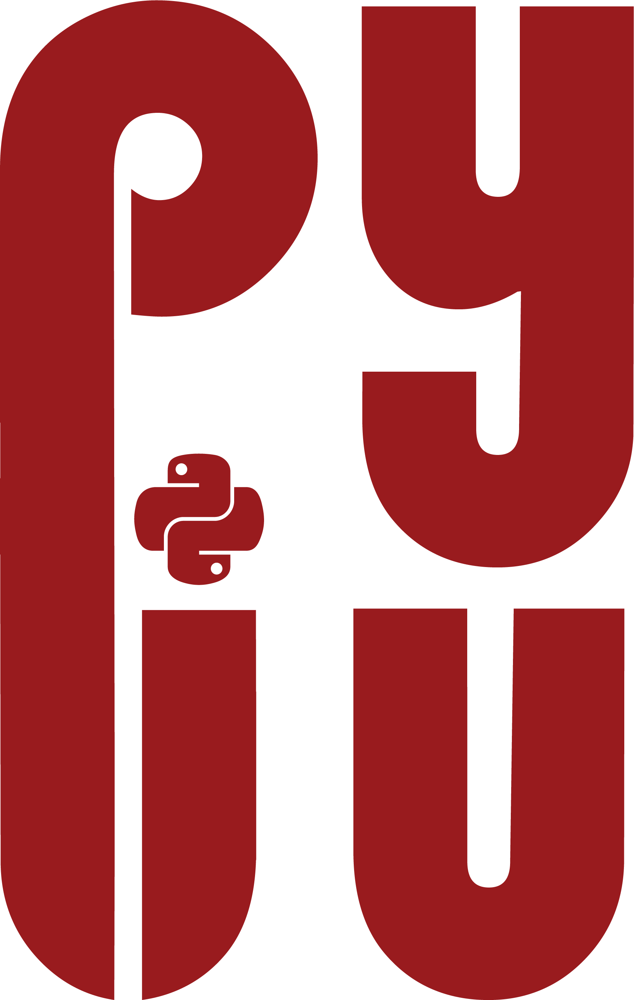

# PyIU

## A Workshop Series on Python Essentials

The PyIU Python Workshops at Indiana University (IU) is a free Python course series presented by IU Astronomy graduate students. Founded in the fall of 2022, PyIU is designed to spark interest in STEM and provide students with the programming and problem-solving skills necessary to succeed in research. The Python Crash Course events, typically held towards the start of every semester, teach the fundamentals of Python and are geared towards Python/programming beginners. The Advanced Python Workshops take place later in the semester and are also beginner-friendly, but offer more resources for adept/experienced users of the language and are focused on more specific applications.

Check out some news highlights from previous iterations of the program here:
- Fall 2024 Crash Course: <a href="astro.indiana.edu/news-events/news/2024-fall-python-crash-course-wrapup.html">https://astro.indiana.edu/news-events/news/2024-fall-python-crash-course-wrapup.html</a>
- Spring 2023 Advanced Workshop: <a href="astro.indiana.edu/news-events/news/2024-fall-python-crash-course-wrapup.html">https://astro.indiana.edu/news-events/news/pythn-crash-course-2023.html</a>

## Get Coding

All materials from these workshops, including tutorials and demos, are free to access and are posted in this GitHub repository. Just navigate to either the "crash-course" or "workshop" folder to start! Note that all Python code is written in notebook format (".ipynb"), and can be easily accessed, without any Python installation, on . Simply download the notebook you'd like to work with, upload it to your Google Drive, and double-click the .ipynb file to get started!

Questions about PyIU? Requests for Python topics? Want to get involved as an instructor? Contact Brandon Radzom at <a href="bradzom@iu.edu">bradzom@iu.edu</a>.
